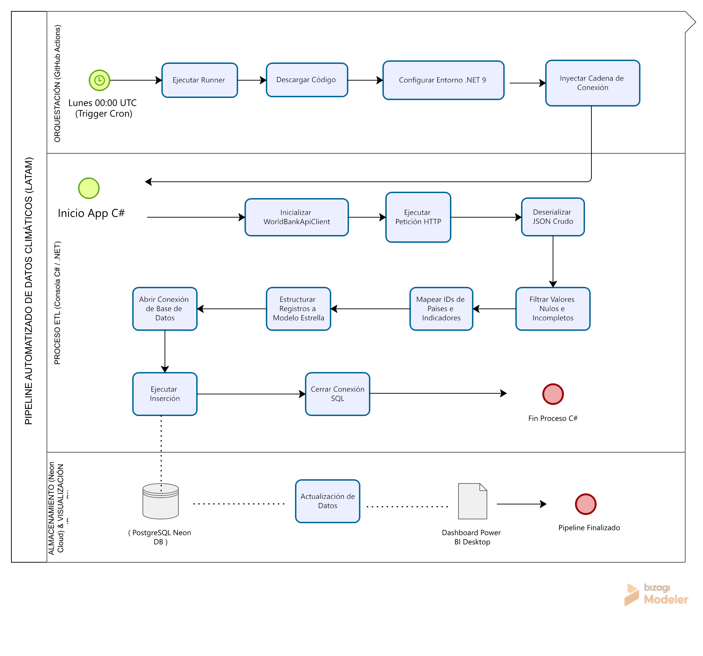
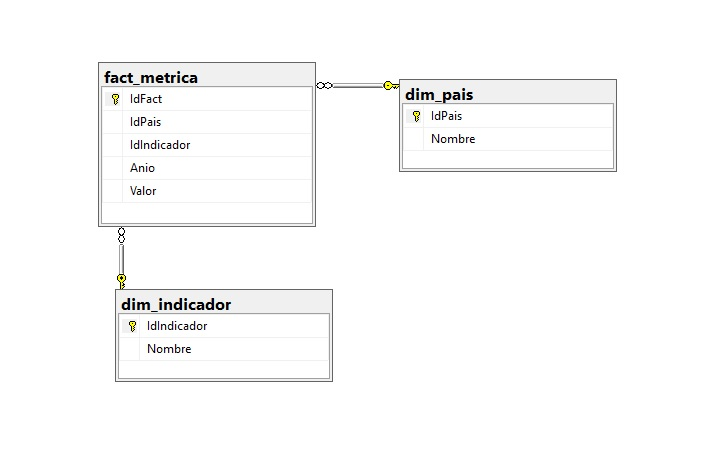
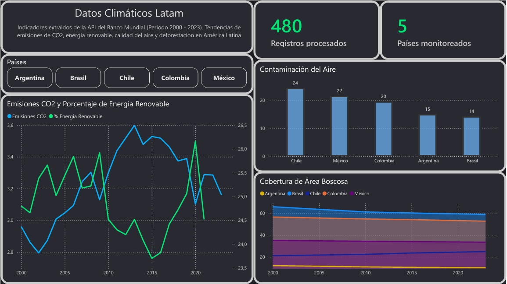

# Pipeline Automatizado de Datos Climáticos en LATAM (ETL)

## Descripción del Proyecto
Este proyecto consiste en un pipeline para la extracción, limpieza, almacenamiento y visualización de indicadores ambientales en América Latina. El sistema interactúa de forma directa con la API del Banco Mundial para recopilar métricas de las principales economías de la región (Argentina, Brasil, Chile, Colombia y México), cubriendo el periodo histórico de 2000 a 2023.

---

## Stack Tecnológico
* **Lenguaje de Programación:** C# (.NET 9) - Proyecto de consola.
* **Orquestación y CI/CD:** GitHub Actions (Programación basada en Cron semanal).
* **Almacenamiento (Nube):** Neon Serverless PostgreSQL.
* **Visualización:** Power BI Desktop.

---

## Detalles de Implementación Técnica (ETL en C#)

### 1. Extracción (Ingesta de Datos)
El pipeline interactúa de manera directa con la API REST del Banco Mundial para recopilar las métricas ambientales. Se configuraron peticiones a los códigos geográficos de la región y a la ventana temporal definida (2000-2023).

### 2. Transformación (Procesamiento y Normalización)
La respuesta cruda de la API se recibe en formato JSON. Esta etapa se encarga de moldear el dato para el entorno analítico. Se remueven registros con valores nulos o inconsistentes

### 3. Carga (Persistencia)
Una vez que el set de datos está limpio y unificado, se ejecuta la transferencia hacia el almacenamiento cloud en Neon PostgreSQL.

---

## Seguridad e Infraestructura (GitHub Secrets)

La cadena de conexión real está encriptada en el repositorio mediante **GitHub Secrets** bajo la clave `NEON_CONN_STR`.

---

## Arquitectura del Proceso 

  

---

## Modelado de Datos 
Los datos se estructuraron bajo un **Modelo en Estrella** en PostgreSQL. 

* **Tabla de Hechos:** `fact_metrica` (Las claves foráneas `IdPais`, `IdIndicador`, `Anio` y `Valor`).
* **Tablas de Dimensiones:** `dim_pais` y `dim_indicador` (Almacenan los atributos descriptivos).

  

### Indicadores Monitoreados (Códigos Oficiales del Banco Mundial)
* `EN.GHG.CO2.PC.CE.AR5` - Emisiones de CO2 (Toneladas métricas per cápita).
* `EG.FEC.RNEW.ZS` - Consumo de energía renovable (% del consumo total de energía final).
* `AG.LND.FRST.ZS` - Área selvática/boscosa (% del área de tierra).
* `EN.ATM.PM25.MC.M3` - Calidad del aire / Exposición media anual a PM2.5 (Microgramos por metro cúbico).

---

## Visualización de Control e Insights (Power BI)
El dashboard actúa como la capa de consumo final del pipeline técnico. El diseño en responde a tres premisas:
1. **Emisiones de CO2 y porcentaje de energía renovable.**
2. **Cobertura de área boscosa.** 
3. **Contaminación del aire.** 

  

---

## Finalidad del Proyecto
Este repositorio fue desarrollado con fines académicos, de práctica y como proyecto de portfolio. 
